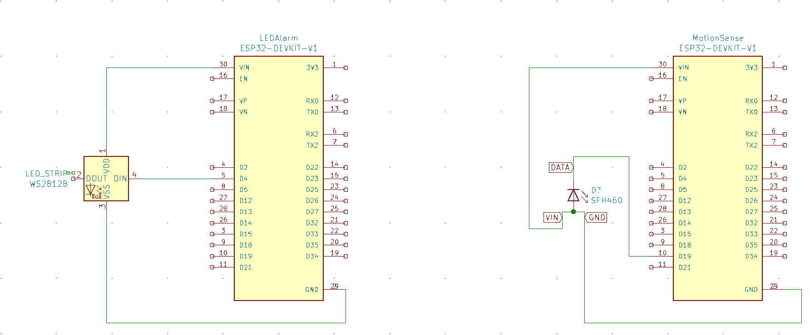

# AlarmSys

## Alarm system that detects motion and warns you using esp_now and LEDs

### Pin dictionary for the LED alarm:

```

```

### Pin dictionary for the Motion sensing system:

```

```

---

## schematic:
[schematics for this project](schematics/)



